**Gazi Üniversitesi**

**Nümerik Analiz Dersi**

**Güz Dönemi 2020/2021**

**Nümerik Analiz Nedir?**

Nümerik Analiz matematik problemlerinin yaklaşık çözümlerini elde etmek
için belli teknikler ile ilgilenen bir matematik dalıdır. Nümerik analiz
17. yüzyıldan beri kullanılmaktadır. Nümerik analizin değeri günümüzde
oldukça büyüktür, bilgisayar programlarının gelişmesiyle günümüzde
neredeyse her türlü üretim alanında aktif olarak kullanılmaktadır.
Nümerik analiz, problemleri çözmek için algoritmalar kullanır ve
algoritmalar istenen sonuçlara yakınsama dizileri üretir. Bu
hesaplamalarda kesinlik yoktur ve belli oranda hata beklenir ancak bu
hata istenen sınırlamalar içinde olmalıdır.

Nümerik analiz kısaca; analitik çözümü olmayan denklemlerin belli
kurallar dahilinde hata payı göz önünde bulundurularak çözme tekniğidir.

Konu hakkında video
https://www.youtube.com/watch?v=t69PeA210U8&list=PLcNWqzWzYG2s5lVEJJK-TPivoT5VS_WTK&index=1

Analitik çözümü bulunan denklemlere örnekler;

$$x^{2} - 9 = 0$$

$$x^{2} - 5x + 6 = 0$$

gibi denklem sistemleri analitik çözümü bulunan denklemlerdir.

Fakat $x^{3} - 8x.tanx + e^{x} = 0\ $

gibi analitik yöntemlerle çözülemeyen denklemler; nümerik analiz
teknikleri ile, belli hata payları dahilinde çözülmeye çalışılır.

Nümerik analiz gündelik hayatımızda şu alanlarda

-Diferansiyel denklemlerde

-Mühendislik uygulamalarında

\- Fonksiyonel Denklemler

i\) adi diferansiyel denklemler

ii\) kısmi diferansiyel denklemler

iii\) İntegral denklemler

iv\) Optimizasyon problemleri

-Cebirsel Denklemler

i\) kök bulma

ii\) doğrusal olmayan denklem sistemleri

iii\) doğrusal sistemler

-Matris problemleri

.

.

.

kullanılır.

**Hata Nedir?**

Nümerik analiz tekniklerinde belli bir hata payı olduğundan
bahsetmiştik. Peki bu hata nasıl hesaplanır?

Hata bulduğumuz değer ile gerçek değeri arasındaki farktır. Bir örnek
verecek olursak;

Gerçek değer:9

Bulunan değer: 8,68

olsun.

Bu durumda Hata:1,32 olacaktır. Fakat hataların sayısal değerinden
ziyade hatanın %'lik oranı bulunmalıdır.

Konuya başlamadan videoya göz atalım.
https://www.youtube.com/watch?v=wGvNOMdedrk&list=PLcNWqzWzYG2s5lVEJJK-TPivoT5VS_WTK&index=2

***Hata Çeşitleri***

Hata çeşitleri sayısal hatalar ve sayısal olmayan hatalar olmak üzere
ikiye ayrılırlar.

Sayısal olmayan hatalar;

a)  ***Mutlak Hata***

Bulunan hatanın negatif çıkmasını önlemek amacıyla ortaya çıkarılmış bir
tekniktir.

Mutlak hata =$⃒gerçek\ değer - hesaplanan\ değer⃒$

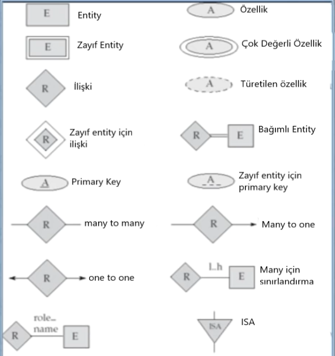

Mutlak hata tekniğinde, gerçek değer ve hesaplanan değerin bilinmesi
gerekir.

Örnek: f(x) fonksiyonunun gerçek değeri 12 iken, bir kişi sonucu 13,1
buluyor. Mutlak hatanın değerini bulun.

Mutlak hata = $|12 - 13,1|$

= 1,1'dir.

b)  ***Bağıl Hata***

Mutlak hatada olduğu gibi bu teknikte de gerçek değer ve hesaplanan
değerin bilinmesi gerekir. Gerçek değer ile hesaplanan değer arasındaki
farkın gerçek değere oranlanması mantığına bağlıdır.

Bağıl hata aşağıdaki işlem ile bulunur:

Bağıl hata = $\frac{Gerçek\ değer - Hesaplanan\ değer}{Gerçek\ değer\ }$

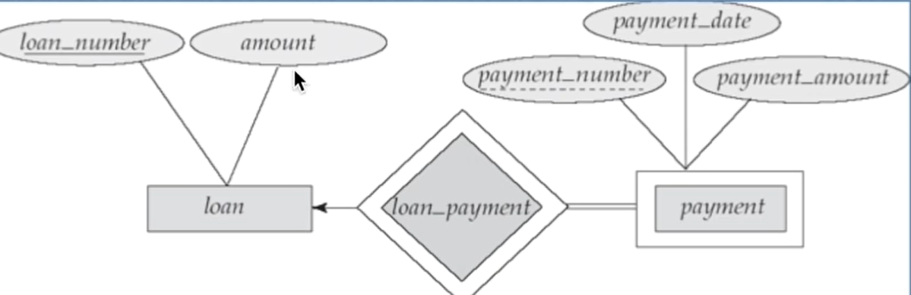

Hatanın yüzdesel değerini bulmak için 100 ile çarpmak yeterlidir.

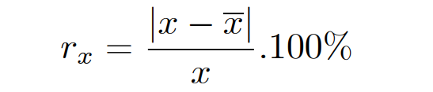

Örnek: π sayısının yaklaşık değeri 3,14 olsun. Bu değerin bağıl hata
oranını hesaplayın.

Bağıl hata = $\frac{\pi - 3,14}{\pi}$

=0,0005069.... \*100

= %0,05069...

sonucu elde edilir.

**Sayısal Çözümlerde Hatalar**

Gündelik hayatımızdaki durumlarda, genellikle gerçek değerler
bilinmemektedir, bu nedenle mutlak hata ve göreceli hata yöntemleri, bu
tür hataları hesaplamak için kullanılamaz. Bu gibi durumlarda, x
sayısının en iyi tahmini kullanılmalıdır, ancak ne yazık ki en iyi
tahmin yine hesapladığımız tahmindir. X'in gerçek değerine ancak x'e
sıralı şekilde verdiğimiz değerler ile yaklaşabiliriz;

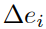 mutlak hata

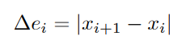

Bağıl hata ise yine benzer şekilde;

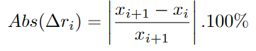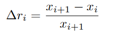veya denklemi ile bulunur.

Örnek olarak; bize bir denklem verilsin ve bu denklemin \[1,3\] arasında
herhangi bir kökünün olup olmadığı sorulduğunda f(1).f(3)\<0 çıkar ise
denklemin bu aralık arasında kesinlikle en az bir kökü vardır
diyebiliriz. Böylece kökümüzü arayacağımız yer gittikçe somutlaşır.

Bu teoremin adı Ara Değer teoremidir.

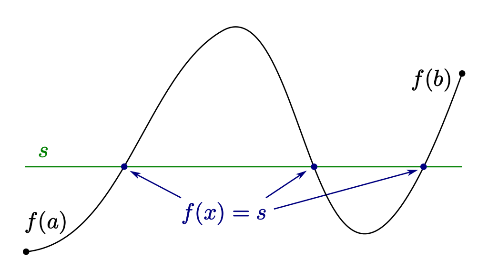

Görüldüğü üzere fonksiyon x=a değeri için negatif sonuç verirken, x=b
için pozitif değer vermektedir. Bu durumda fonksiyon bu aralıkta x
eksenini en az bir kez kesmek zorundadır.

Video https://www.youtube.com/watch?v=EGCf5TSaNRA

**Sayısal Analizde Hata Kaynakları**

Sayısal bir hesaplamada iki durumdan dolayı hatalar meydana gelebilir:

1.  Kesme Hataları

2.  Yuvarlama Hataları

**1.Kesme Hataları**

Kesme hataları isminden anlaşılacağı üzere belli bir değerin
yuvarlanması sonucu oluşan bir hata türüdür. Örneğin bir sayının değeri
299792458 olsun;

Bu sayının 2.99x$10^{8}$ şeklinde yazılması belli bir hataya yol açar.

Kesme hatalarında Taylor Serisi'nin kavranması çok önemlidir.

Taylor Serisi şu şekildedir:

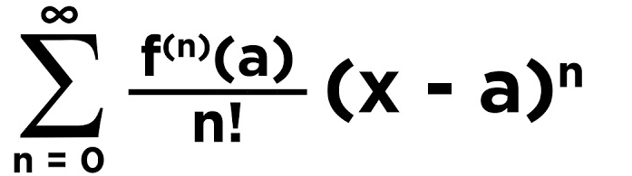

Maclaurin Serisi de Taylor Serisi'nden türetilmiştir;

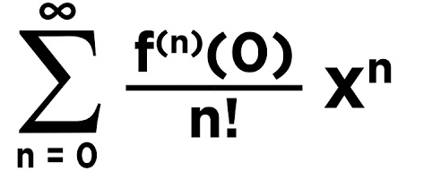

Aralarındaki fark sadece a'nın 0 seçilmesidir.

Seriyi tam olarak kavrayabilmek için videoyu izleyin.

https://www.youtube.com/watch?v=NqCPeLclcys&list=PLcNWqzWzYG2s5lVEJJK-TPivoT5VS_WTK&index=3

Yukarıdaki videodan sonra bu videoyu izleyebilirsiniz.
https://www.youtube.com/watch?v=O6VIdgPebVo&list=PLcNWqzWzYG2s5lVEJJK-TPivoT5VS_WTK&index=4

**2.Yuvarlama Hataları**

Yuvarlama hataları da kesme hatalarına oldukça benzemektedir. Yuvarlama
hataları kısaca şöyle açıklanabilir;

38,78632158 yalnızca virgülden sonraki iki basamağı yazılacak şekilde
sayıyı yuvarlayalım.

-   Sayı **38,79** olur.

> Buradaki önemli nokta virgülden sonraki 3.(virgülden sonra istenilen
> basamak sayısının bir fazlası) basamağın büyüklüğüdür. Örneğin burada
> 3. basamak 6 olduğundan dolayı 2. basamak 1 arttırıldı, 5 veya 5'ten
> küçük olsa idi sayımız **38,78** olacaktı.

Görüldüğü gibi yuvarlama işlemi belli bir hataya neden olur.

Peki kesme işlemi yaparken nelere dikkat edilmeli?

Önemli sayıları kesmemeye özen gösterilmelidir.

1.  1'den 9'a kadar olan tüm rakamlar önemlidir.

2.  Öndeki sıfırlar her zaman için önemsizdir.

3.  Sayılar arasındaki 0 her zaman önemlidir.

4.  Eğer 0 ondalık sayı belirtiyorsa (3.0 veya 300.) şeklinde önemlidir.

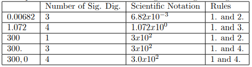

Bilgisayarlar bu sayıları, ikilik sayı sistemine çevirerek kullanır.
Aşağıdaki sistem sayesinde kolayca çevrilebilir. 263,03 e bakalım:

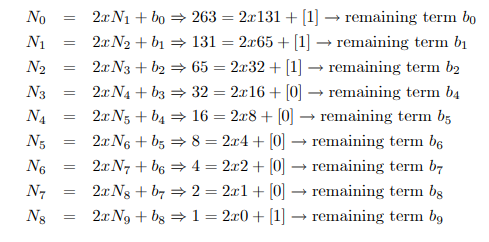

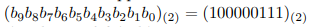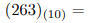

Virgülden sonrası için bu işlemin tersi yapılır. Yani 2 ye bölmek yerine
2 ile çarpılır;

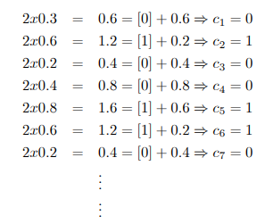

Sayı sisteminde Çevirmeler hakkında detaylı video

-   <https://www.youtube.com/watch?v=Ik80C3VPs3E>

Bilgisayar aritmetiği ve hatalarına yönelik detaylı anlatım için
aşağıdaki pdf i inceleyebilirsiniz.

-   [https://acikders.ankara.edu.tr/pluginfile.php/1106/mod_resource/content/2/4.%20Bilgisayar%20Aritmetiği.pdf](https://acikders.ankara.edu.tr/pluginfile.php/1106/mod_resource/content/2/4.%20Bilgisayar%20Aritmetiği.pdf)

**Lineer Olmayan Denklemlerin Kökünü Bulma**

Öncelikli olarak Lineer olmayan denklemlerden bahsedelim.

Lineer bir bilinmeyenli denkleme örnek : 8x -9 = 0

Lineer olmayan bir bilinmeyenli denkleme örnek : $x^{2} - 9 = 0$

Nümerik analiz bu denklemlerle uğraşmaz çünkü bu denklemlerin kesin
sonuçları vardır ve kolayca bulunabilir.

Lineer olmayan ve analitik yöntemlerle çözülemeyen denkleme örnek :

$x^{4} - 7x^{3} + 6x^{2} - 3 = 0$

$$x^{3} - tanx = 0$$

gibi denklemler.

Bu denklemlerin kesin sonuçlarını bulmak zordur, kullanılacak olan
teknikler ile bulunan değerler belli hata oranlarına sahip yaklaşık
değerlerdir.

Denklemleri çözme tekniklerine örnek kaynaklar :

**İkiye Bölme tekniği :**
[https://acikders.ankara.edu.tr/pluginfile.php/1107/mod_resource/content/3/5.%20Denklemlerin%20köklerini%20bulma.pdf](https://acikders.ankara.edu.tr/pluginfile.php/1107/mod_resource/content/3/5.%20Denklemlerin%20köklerini%20bulma.pdf)

<https://www.youtube.com/watch?v=6IMOAUfV1es&list=PLcNWqzWzYG2s5lVEJJK-TPivoT5VS_WTK&index=12>

**Tekrarlama metodu:**

<https://www.youtube.com/watch?v=El25xqWRlN4&list=PLcNWqzWzYG2s5lVEJJK-TPivoT5VS_WTK&index=25>

**Grafik metodu:**

<https://www.google.com/url?sa=t&rct=j&q=&esrc=s&source=web&cd=&cad=rja&uact=8&ved=2ahUKEwjbzdP9v_TvAhWHDuwKHQL0AlUQFjAAegQIAxAD&url=https%3A%2F%2Favesis.yildiz.edu.tr%2Fresume%2Fdownloadfile%2Fhbayir%3Fkey%3Dfbb141bb-a302-4e01-af2a-bcbd0efeaa65&usg=AOvVaw1mmedg7cAgAT_X3z8ORZFL>
(Bu link birçok metodu barındırıyor.)

Sayfa -- 7

**Newton Raphson Metodu:**

https://www.youtube.com/watch?v=I7zpcF_kmew&t=1242s

Gazi Üniversitesi Nümerik Analiz Dersi konularının özetleri ve
çalışılabilecek kaynakların derlemesi.

KAYNAKLAR

Boğaziçi Ders Eğitim Youtube Kanalı

Ankara Üniversitesi Açık ders kaynakları

Gazi Üniversitesi Ders Sunumları
